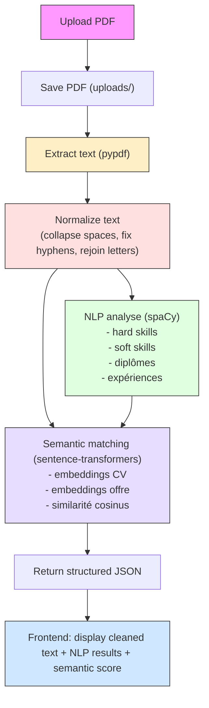

# JobAlign

CV & Job Offer Analyzer with Local AI

## Quick Start

### Requirements

- Version python : **3.11**
- Ollama with 1 model

**Backend:**

```bash
cd backend
pip install -r requirements.txt
venv\Scripts\activate
python main.py
```

**Frontend:**

```bash
cd frontend
npm install
npm run dev
```

**Ollama:**

```bash
ollama serve
```

## Structure

```
├── backend/
│   ├── main.py
│   ├── requirements.txt
│   └── .env.example
├── frontend/
│   ├── src/
│   ├── package.json
│   ├── vite.config.js
│   └── index.html
├── CONTEXT.md
├── FEATURES.md
└── LOGBOOK.md
```

See CONTEXT.md, FEATURES.md for more details.

## Pipeline


