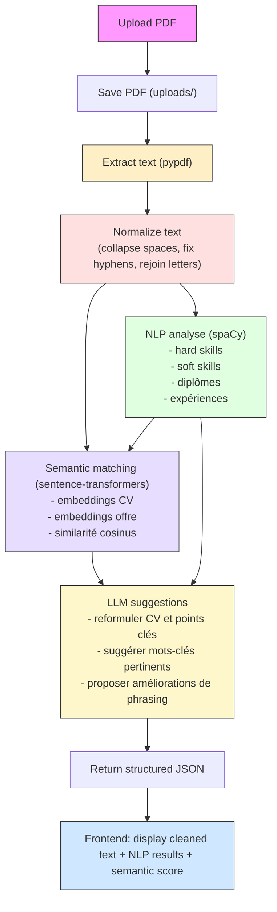

# JobAlign

CV & Job Offer Analyzer with Local AI

## Quick Start

### Requirements

- Version python : **3.11**
- Ollama with 1 model

## Lancement avec Docker

Le plus simple pour démarrer le projet en conteneurs est:

```bash
docker compose up --build
```

Cette commande démarre:

- le backend FastAPI sur `http://localhost:8000`
- le frontend Vite sur `http://localhost:5173`

Variables d'environnement minimales prises en compte par le compose:

- Frontend: `VITE_API_URL=http://localhost:8000`
- Backend: `OLLAMA_BASE_URL=http://host.docker.internal:11434`, `OLLAMA_MODEL=qwen3.5`

Les autres paramètres conservent leurs valeurs par défaut (`OLLAMA_TIMEOUT_SECONDS`, `OLLAMA_LETTER_MODEL`, `JOBALIGN_EMBEDDING_MODEL`) et ne sont à changer que si vous voulez ajuster le comportement du modèle local.

Le backend attend toujours une instance Ollama locale accessible depuis l'hôte. Sur Docker Desktop, `host.docker.internal` permet au conteneur de joindre Ollama lancé sur la machine.

**Backend:**

```bash
cd backend
pip install -r requirements.txt
venv\Scripts\activate
python main.py
```

**Frontend:**

```bash
cd frontend
npm install
npm run dev
```

**Ollama:**

```bash
ollama serve
```

## Variables d'environnement

Pour un lancement natif sans Docker:

- Backend: `BACKEND_HOST=localhost`, `BACKEND_PORT=8000`, `OLLAMA_BASE_URL=http://localhost:11434`, `OLLAMA_TIMEOUT_SECONDS=60`, `OLLAMA_MODEL=qwen3.5`, `OLLAMA_LETTER_MODEL=qwen3.5`
- Frontend: `VITE_FRONTEND_PORT=5173`, `VITE_API_URL=http://localhost:8000`

Les modèles Ollama restent locaux et aucun appel API externe n'est utilisé.

## Structure

```
├── backend/
│   ├── main.py
│   ├── requirements.txt
│   └── .env.example
├── frontend/
│   ├── src/
│   ├── package.json
│   ├── vite.config.js
│   └── index.html
├── CONTEXT.md
├── FEATURES.md
└── LOGBOOK.md
```

See CONTEXT.md, FEATURES.md for more details.

## Pipeline


